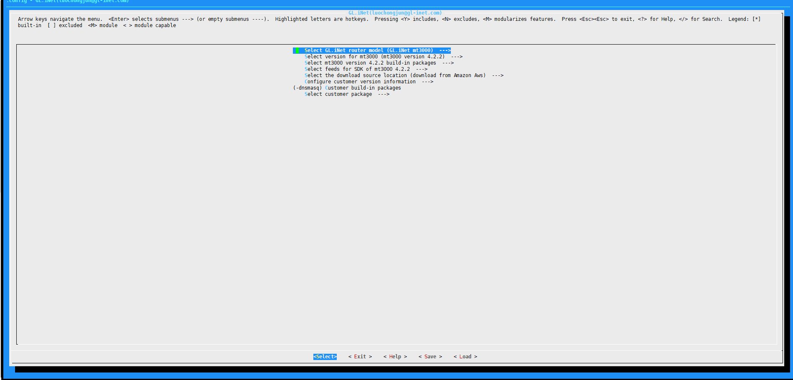
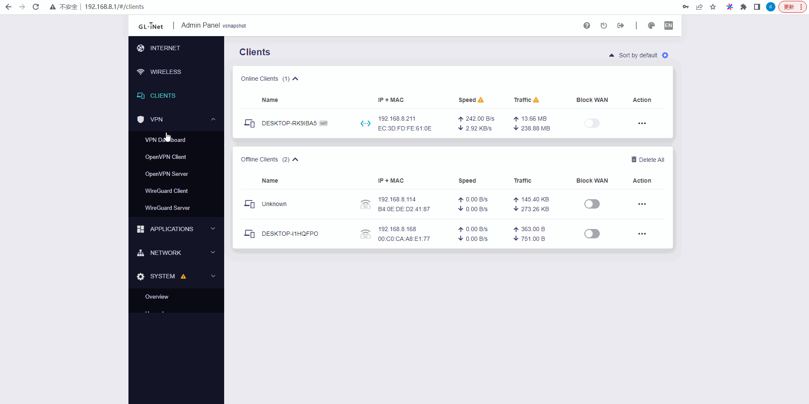

# glbuilder

## Documentation
[English](./)

[中文](./Readme-cn.md)

## Introduction
Before this project, I had a post on the glinet Chinese forum to teach you how to package the firmware with the glinet page based on [gl-infra-builder](https://github.com/gl-inet/gl-infra-builder) , many users like it. Since the driver part uses the driver code maintained by many chip manufacturers, we have no right to open it to users. We have tried to provide it to users in the form of ko, but we will always encounter many strange problems. For this reason, I built the glbuilder project based on the gl-infra-builder output imagebuilder and SDK to solve the current problem.

**glbuilder also supports complete construction of firmware with glinet UI interface. At the same time, it also supports direct integration of ipk files and source code files**. In addition, in order to make it easier for more novice users to enjoy compiling, I also configured menuconfig for the project Graphical interface and domestic source.



## Firmware functions show


## Install environment
```
sudo apt update 
sudo apt install device-tree-compiler g++ ncurses-dev python asciidoc bash bc binutils bzip2 fastjar flex gawk gcc genisoimage gettext git intltool jikespg libgtk2.0-dev libncurses5-dev libssl-dev make mercurial patch perl-modules python2.7-dev rsync ruby sdcc subversion unzip util-linux wget xsltproc zlib1g-dev zlib1g-dev -y
```

## Clone repository
```
git clone https://github.com/gl-inet/glbuilder && cd glbuilder
```

## Compile firmware that supports GL UI (basic configuration)

1. Enter the menuconfig interface to configure
```
make menuconfig
```
2. Select the router model in the Select GL.iNet router model option.
3. In the Select version for mt3000 option, select the version based on the official firmware for subsequent modification.
4. In the Select mt3000 version 4.2.2 build-in packages option, you can choose the built-in package of glinet. Novices suggest to keep the default and not modify it.
5. Select feeds for SDK of mt3000 The 4.2.2 option can enable the feeds of the SDK, and disabling feeds without using them can speed up the speed of source code compilation. For beginners, it is recommended to keep the default without modification.
6. Select the download source location option to select the download source of imagebuilder and SDK image, mainland users are recommended to choose China Aliyun
7. Under Configure customer version information, you can configure your own version number, version type, releasenotes and other version-related content, and you can modify it according to the actual situation
8. After the above configuration is completed, do not pay attention to other configuration options for the time being, save and exit and execute
```
make
```
9. After the compilation is completed, the compiled image will be in the bin/<model>/<version>/target directory of the current directory


## Add your own IPK

1. We have two ways to get the ipk file, through the remote repository or the customer/ipk local directory. For the local ipk file, we need to manually copy it to the customer/ipk directory. The remote repository address is defined in board/<model>/<version>/distfeeds.conf, which can be modified by yourself. In order to avoid the inconsistency between the compiled firmware and the official release version due to the remote repository version update, the remote repository is disabled by default. If you want to use please cancel the selection of the **Imagebuilder do not use remote repository option** in the **Global option** option, and execute **make imagebuilder/clean** to make the configuration option take effect immediately.
2. Complete the [basic configuration](#compile-firmware-that-supports-gl-ui-basic-configuration) according to your own needs(do not need to execute the final make)
3. Add the IPK name in the Customer build-in packages option, such as luci-app-aria2; if you want to remove a certain package, you can add a '-' symbol in front, such as -dnsmasq means that dnsmasq does not need to be installed. In the project board/<model>/<version>/version_info.mk, there are some removed packages preset by gl_collision_package. The reason is that these packages conflict with the preset packages of glinet. If necessary, you can edit and modify the corresponding gl_collision_package variable.
4. Save the configuration and exit, execute
```
make
```
5. The location of the compiled image is the same as the location of the image in the basic configuration


## Add your own source code

1. Clone your own source code files into the customer/source directory of the project root directory
2. Complete the [basic configuration](#compile-firmware-that-supports-gl-ui-basic-configuration) according to your own needs(do not need to execute the final make)
3. Select the package that you need to compile into the firmware in the Select customer package directory. The directory expansion in this directory is based on each Makefile in the source code, which is consistent with the expansion method of the official openwrt source code.
4. Save the configuration and exit, execute
```
make
```
5. The compiled ipk file is in the bin/<model>/<version>/package directory of the current directory
6. The location of the compiled image is the same as that in the basic configuration

## Add your own files
Create a files directory in the project root directory and put your own files, for example
```
mkdir -p files/etc/config
echo "test my files" >files/etc/config/test_config
```
The firmware compiled in this way can see the test_config file in the /etc/config/ directory in the file system

### For example, change the default wifi name

1. Please get the **/rom/etc/uci-defaults/02_gl_wifi** file in the device file system via winscp tools

2. You can modify the **02_gl_wifi** to set the wifi what you want, for examle, if you want to change device wifi as GL-xxx(xxx is last three digits of device ID), you need to make the following changes in the **02_gl_wifi file**:

2.1 Add **device_id=$(cat /proc/gl-hw-info/device_ddns | cut -c5-7)** command to get last three digits of device ID after **country=$(cat /proc/gl-hw-info/country_code)** command, the code snippet is as follows:
```
country=$(cat /proc/gl-hw-info/country_code)
device_id=$(cat /proc/gl-hw-info/device_ddns | cut -c5-7)
```

2.2 Chang **local ssid="GL-$model-$mac"** to **local ssid="GL-$device_id"**, the code snippet is as follows:
```
fix_wifi_iface() {
    local ssid="GL-$model-$device_id"
    local guest="guest2g"
```

2.3 Chang **local ssid="GL-$model-$mac"** to **local ssid="GL-$device_id"**, the code snippet is as follows:
```
    echo "$band" | grep -q 5 && {
        ssid="GL-$model-$device_id-5G"
        guest="guest5g"
```
3. Create a directory in the project root directory and put your own files
```
mkdir -p files/etc/uci-defaults/
```
4. Cp **02_gl_wifi** file to **files/etc/uci-defaults/**
5. Change the **02_gl_wifi** file permission
```
chmod 775 files/etc/uci-defaults/02_gl_wifi
```
6. Compile the firmware again
```
make
```
### For example, enable GoodCloud
1. Please get the **/rom/etc/uci-defaults/gl-cloud** file in the device file system via winscp tools

2. Add some commands to the end of the file, the code snippet is as follows:
```
uci -q delete glconfig.cloud
uci commit
uci set gl-cloud.@cloud[0].enable1="1"
uci set gl-cloud.@cloud[0].server="gslb-us.goodcloud.xyz"
uci set rtty.general.ssh_en=1
uci set rtty.general.web_en=1
uci commit
```
	Note:
	America server is: gslb-us.goodcloud.xyz
	Europe server is: gslb-eu.goodcloud.xyz
	Asia Pacific server is: gslb-jp.goodcloud.xyz

3. Create a directory in the project root directory and put your own files
```
mkdir -p files/etc/uci-defaults/
```
4. Cp **gl-cloud** file to **files/etc/uci-defaults/**
5. Change the gl-cloud file permission
```
chmod 775 files/etc/uci-defaults/gl-cloud
```
6. Compile the firmware again
```
make
```
## Disable detect firmware
Please disable the device detect the latest firmware, otherwise this function may replace your customized firmware
1. Create a files and directory in the project root directory
```
mkdir -p files/etc/uci-defaults/
touch files/etc/uci-defaults/04_gl_upgrade
chmod 775 files/etc/uci-defaults/04_gl_upgrade
```
2. Write some commands to disable detect the latest firmware
```
echo uci set upgrade.general.url="www"  >> files/etc/uci-defaults/04_gl_upgrade
echo uci commit upgrade  >> files/etc/uci-defaults/04_gl_upgrade
```
3. Compile the firmware again
```
make
```
## TIPS
1. Compilation in the form of source code and IPK can be combined with each other
2. The packages removed using the '-' symbol in the Customer build-in packages option may be reselected by other dependencies, and the corresponding dependent packages need to be removed at the same time
3. When a problem occurs, it can be debugged step by step. Currently, the commonly used subcommands are:
```
make sdk/download #Download SDK image
make sdk/prepare #Decompress the SDK image and configure some basic files
make sdk/feeds/update #Update SDK feeds
make sdk/compile #Use the SDK to compile the source code package
make sdk/install #Copy the compiled ipk to the bin directory
make sdk/package/index #Generate index for compiled ipk
make sdk/clean #Clear all SDK related compilation environment

make customer/source/<path>/compile #Compile a single package in the customer/source/ directory
make customer/source/<path>/clean #Clear the compilation environment and IPK file of the specified package in the customer/source/ directory
make customer/ipk/index #Generate index for IPK files in the cuntomer/ipk directory

make imagebuilder/download #Download imagebuilder image
make imagebuilder/prepare #Decompress the imagebuilder image and configure some basic files
make imagebuilder/compile #package firmware
make imagebuilder/clean: #Clear all imagebuilder related compilation environment

make menuconfig #Enter the configuration menu
make clean #Delete the build directory and temporary files
make distclean #Delete the build directory and temporary files, delete the generated image files and all build tools

```